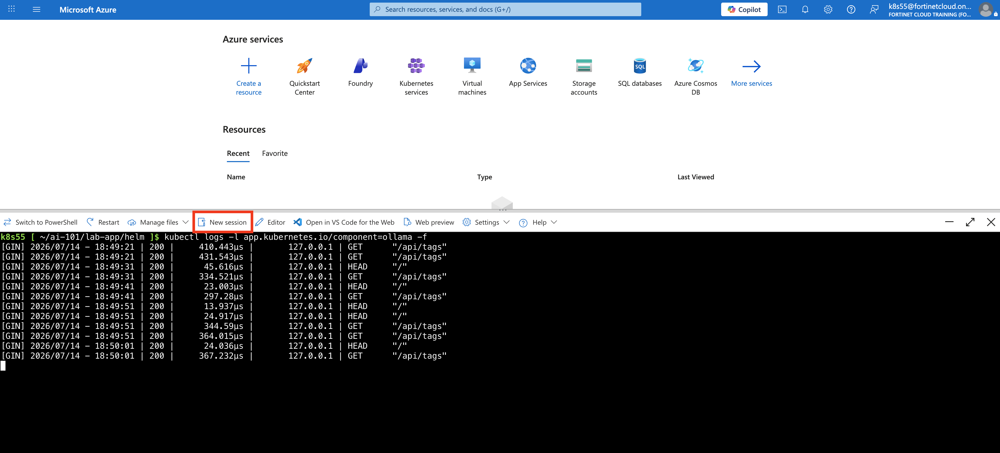
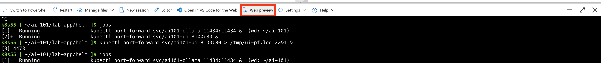
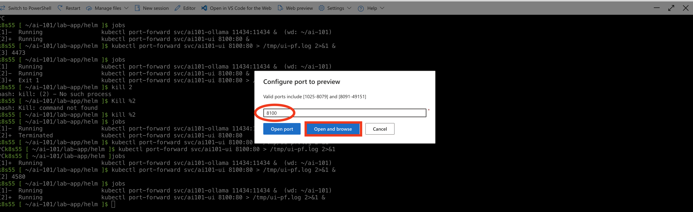

## Prerequisites

| Requirement | Version | Check |
|-------------|---------|-------|
| kubectl | 1.28+ | `kubectl version --client` |
| Helm | 3.14+ | `helm version` |
| jq | 1.6+ | `jq --version` |
| A running cluster | — | `kubectl cluster-info` |
| Default StorageClass | — | `kubectl get storageclass` |

The Helm chart creates a PersistentVolumeClaim for Ollama's model cache. A
default StorageClass is required unless you set `ollama.storage.storageClassName`
explicitly.

If your cluster has no default StorageClass (check with `kubectl get storageclass`),
install [Rancher local-path-provisioner](https://github.com/rancher/local-path-provisioner) — it uses local node disk and works on any cluster:

```bash
kubectl apply -f https://raw.githubusercontent.com/rancher/local-path-provisioner/master/deploy/local-path-storage.yaml
kubectl patch storageclass local-path -p '{"metadata":{"annotations":{"storageclass.kubernetes.io/is-default-class":"true"}}}'
```

{}
Ollama needs at least 4 GB RAM on the node where it schedules. If your cluster
nodes are smaller, set the `OLLAMA_MODEL` env var to a lighter model in
`values-lab1.yaml`.
{}

## 1. Reconnect from Azure Cloud Shell

### - Verify Kubernetes access

```bash
kubectl config current-context
kubectl get nodes
```
If kubectl get nodes works, you are connected to the cluster and continue to the Clone the repo step. 

### - Run ONLY If access is lost

refresh the kubeconfig from the K8s 101 master node

```bash
cd $HOME/k8s-101-workshop/terraform/

nodename=$(terraform output -json | jq -r .linuxvm_master_FQDN.value)
username=$(terraform output -json | jq -r .linuxvm_username.value)

rm -rf $HOME/.kube/
mkdir -p $HOME/.kube/

scp -o 'StrictHostKeyChecking=no' $username@$nodename:~/.kube/config $HOME/.kube/config

kubectl get nodes
kubectl config view --minify -o jsonpath='{.clusters[0].cluster.server}'; echo
```

## - Clone the repo

```bash
cd ~
git clone https://github.com/FortinetCloudCSE/ai-101.git
cd ai-101
```

## - Install the chart for Lab 1

- Pre-built multi-arch images (amd64 + arm64) are published to GHCR and pulled
automatically by the cluster — no manual image pull required.


{}
```bash
cd lab-app/helm
helm upgrade --install ai101 ./ai101 -f ai101/values-lab1.yaml
```
{}
{}

```bash
Release "ai101" does not exist. Installing it now.
NAME: ai101
LAST DEPLOYED: Tue Jul 14 18:35:02 2026
NAMESPACE: default
STATUS: deployed
REVISION: 1
DESCRIPTION: Install complete
TEST SUITE: None
```
{}


- Wait for the Ollama pod to start, then follow its logs to track the model download:


{}
```bash
kubectl get pods -w
```
{}
{}
```bash
NAME                           READY   STATUS    RESTARTS   AGE
ai101-ollama-8699cc758-sqrgt   1/1     Running   0          12m
 ```
{}


- Once the `ai101-ollama-*` pod shows `Running` (may take 60–90 s for the image pull)


{}

To open a new terminal in Azure Cloud Shell, click on the New Session tab

  
{}

{}
```bash
kubectl logs -l app.kubernetes.io/component=ollama -f
```
{}
{}

```bash
[GIN] 2026/07/14 - 18:49:21 | 200 |     410.443µs |       127.0.0.1 | GET      "/api/tags"
[GIN] 2026/07/14 - 18:49:21 | 200 |     431.543µs |       127.0.0.1 | GET      "/api/tags"
[GIN] 2026/07/14 - 18:49:31 | 200 |      45.616µs |       127.0.0.1 | HEAD     "/"
[GIN] 2026/07/14 - 18:49:31 | 200 |     334.521µs |       127.0.0.1 | GET      "/api/tags"
[GIN] 2026/07/14 - 18:49:41 | 200 |      23.003µs |       127.0.0.1 | HEAD     "/"
```
{}


## - Verify

First, port-forward the Ollama service so Cloud Shell can reach the Ollama API running inside the Kubernetes cluster (or background it with `&`):


{}
```bash
kubectl port-forward svc/ai101-ollama 11434:11434 > /tmp/port-forward.log 2>&1 &
```

Then, in a new terminal or current terminal, send a test prompt to the Ollama OpenAI-compatible API endpoint:

```bash
curl -s http://localhost:11434/v1/chat/completions \
  -H "Content-Type: application/json" \
  -d '{"model":"qwen2.5:3b","messages":[{"role":"user","content":"ping"}]}' \
  | jq -r '.choices[0].message.content'
```
If the command returns a text response, Ollama is running successfully and the model is able to perform inference.
{}

{}
Pong! Your request was "ping", and my response is "Pong". I hope that answered your question about the status of your connection to me! If you need assistance with something else, feel free to ask.
{}


The `kubectl port-forward` command creates a temporary connection from `localhost:11434` in Azure Cloud Shell to the Ollama service running inside the Kubernetes cluster. The `curl` command then sends a small test prompt to that local endpoint. Kubernetes forwards the request to Ollama, Ollama runs the model, and the model response is returned back to Cloud Shell.

## - Reference — upgrade per lab

```bash
cd lab-app/helm

# Lab 1 — Ollama only
helm upgrade --install ai101 ./ai101 -f ai101/values-lab1.yaml

# Lab 2 — Agent (hardcoded tools) + UI
helm upgrade --install ai101 ./ai101 -f ai101/values-lab2.yaml

# Lab 3 — Agent (MCP mode) + MCP server + UI
helm upgrade --install ai101 ./ai101 -f ai101/values-lab3.yaml

# Lab 4 — Same as lab3 (security demo steps use env overrides)
helm upgrade --install ai101 ./ai101 -f ai101/values-lab4.yaml
```

Access the UI (Lab 2 and later only — the UI is not deployed in Lab 1):
```bash
kubectl port-forward svc/ai101-ui 8100:80 > /tmp/ui-pf.log 2>&1 &
```

Then open [http://localhost:8100](http://localhost:8100) in a browser.

**Azure Cloud Shell users** — `localhost` is not reachable from your browser. Use Web Preview instead:
click the **Web Preview** icon (top-right toolbar) → **Configure** → port **8100** → **Open and browse**.

  

  

{}
Leave the release running as you work through the labs. Each lab section tells you which values file to upgrade to. Only uninstall when you are completely done.
{}

---

The two sections below are **not part of the lab flow** — they are reference material for optional extensions and post-workshop teardown.

## - Optional — FortiAIGate routing

To route the agent through FortiAIGate instead of the local Ollama:

```bash
helm upgrade ai101 ./ai101 -f ai101/values-lab4.yaml \
    --set agent.openaiBaseUrl=https://your-fortiaigate-host/v1
```

See the [FortiAIGate Workshop](https://fortinetcloudcse.github.io/faig-training-workshop/)
for policy configuration details.

## - Cleanup (after the workshop)

```bash
helm uninstall ai101
kubectl delete pvc ai101-ollama-data
```
