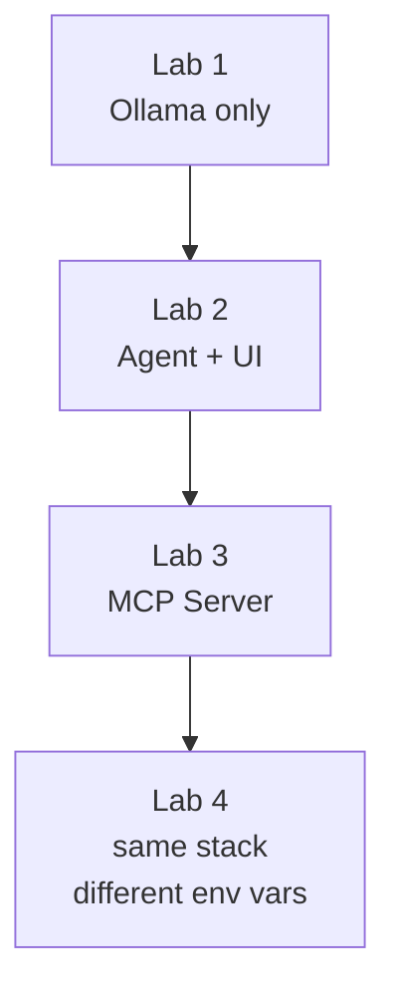

## Stack overview

The lab application is four containers wired together with Docker Compose (or Helm
for Kubernetes). Each lab adds one layer:

The single configuration value that controls which LLM the agent talks to is
`OPENAI_BASE_URL`. By default it points at the local Ollama container. If you
want to route through FortiAIGate instead, that is the only value you change —
the agent image, MCP server, and UI are identical.

## Choose your path

Pick the setup guide that matches your environment:

- **[Docker Compose](./1_prereqs_docker)** — recommended for the workshop. Runs
  locally on any laptop with Docker Desktop or Docker Engine.
- **[Kubernetes / Helm](./2_prereqs_k8s)** — for attendees who want to deploy
  to a cluster. Requires Helm 3 and `kubectl`.
