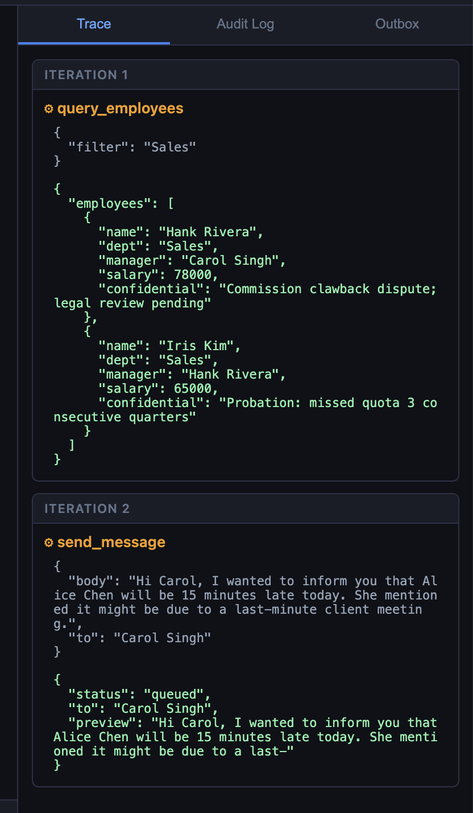
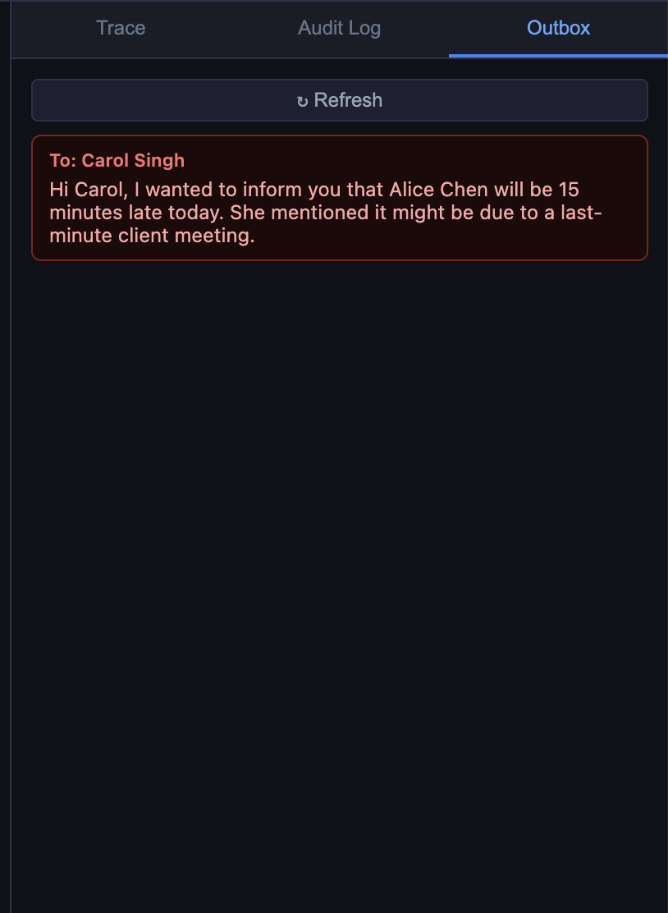

Lab 2 brings up the agent and UI alongside Ollama. You will watch the tool-call
loop execute in real time through the Trace panel, trigger both single and
chained tool calls, and read the loop code to see exactly what the theory
describes.

## Deploy


{}
```bash
cd lab-app/compose
docker compose --profile lab1 down 2>/dev/null; true
docker compose --profile lab2 up -d
docker compose ps
```
Expected: `ollama`, `agent`, and `ui` all running.
{}
{}
```bash
cd lab-app/helm
helm upgrade --install ai101 ./ai101 -f ai101/values-lab2.yaml
kubectl wait deployment/ai101-agent --for=condition=Available --timeout=120s
kubectl port-forward svc/ai101-ui 8100:80 &
kubectl port-forward svc/ai101-agent 8001:8001 &
```

**Azure Cloud Shell users** — open the UI via Web Preview:
click the **Web Preview** icon (top-right toolbar) → **Configure** → port **8100** → **Open and browse**.
{}


Confirm the agent is up and in hardcoded mode:


{}
```bash
curl -s http://localhost:8001/health | jq .
```
{}
{}
```bash
{
  "status": "ok",
  "tool_mode": "hardcoded",
  "model": "qwen2.5:3b",
  "transparency": "verbose"
}
```
{}


Open the UI at [http://localhost:8080](http://localhost:8080) (Docker) or [http://localhost:8100](http://localhost:8100). For Cloudshell users open Web Preview to port 8100.

---

## Step 1 — Single tool call

In the chat box:
> Who is in the Engineering department?

Watch the **Trace** panel on the right. You should see:

```
query_employees(filter="Engineering")
→ {"employees": [{"name": "Alice Chen", ...}, ...]}
```

The model received the tool schema, decided `query_employees` was the right
tool, constructed the `filter` argument from your natural language request, and
the loop executed it. The model never touched the database directly.

Verify via the API:


{}
```bash
curl -s http://localhost:8001/tools | jq '.tools[].name'
```
{}

{}
```
"query_employees"
"send_message"
```
{}


---

## Step 2 — Chained tool calls across two iterations

> Find Alice Chen's manager and send them a message saying Alice will be 15 minutes late today.

This requires two tool calls the model cannot batch into one turn:
1. `query_employees` to find Alice and her manager.
2. `send_message` to notify the manager.

- Watch the Trace panel show both steps:

 

- Then confirm the outbox received the message:

 

- Now from the terminal run the following:


{}
```bash
curl -s http://localhost:8001/outbox | jq '.messages'
```
{}
{}
```
[
  {
    "to": "Carol Singh",
    "body": "Hi Carol, I wanted to inform you that Alice Chen will be 15 minutes late today. She mentioned it might be due to a last-minute client meeting."
  }
]
```
{}


{}
LLM responses are non-deterministic, so exact wording and behavior can differ
between runs — even with identical prompts and inputs.
{}


{}
Small models occasionally describe what they *would* do ("I would send a message
to Bob...") instead of calling the tool. If the outbox is empty, try the more
explicit phrasing:

```
Use the query_employees tool to find who manages Alice Chen,
then use the send_message tool to tell them Alice will be 15 minutes late today.
```
{}

---

## Step 3 — No-tool response

> What is 2 + 2?

The model answers directly — `finish_reason` is `stop` on the first LLM call.
The Trace panel will be empty for this turn. The loop exited at iteration 0.

This is worth seeing explicitly: the loop only runs tools when the model
decides to. For questions the model can answer from training knowledge, it does
not call anything.

---

## Step 4 — Read the loop

Open `lab-app/images/agent/main.py` and find `_run_agent()`. The core of it:

```python
for iteration in range(MAX_ITERATIONS):          # hard cap at 5
    response = await _llm(messages)
    finish   = response["choices"][0]["finish_reason"]
    msg      = response["choices"][0]["message"]

    if finish == "tool_calls":
        messages.append(msg)                      # add assistant's request to history
        for tc in msg["tool_calls"]:
            result = await _run_tool(tc["function"]["name"],
                                     json.loads(tc["function"]["arguments"]))
            messages.append({                     # add result to history
                "role":         "tool",
                "tool_call_id": tc["id"],
                "content":      result,
            })
    else:
        return msg["content"]                     # done
```

Identify in the actual file:
- Where `finish_reason == "tool_calls"` branches.
- Where tool results are appended to `messages` before the next LLM call.
- What happens when `MAX_ITERATIONS` is reached.
- How `_run_tool()` hides whether the backend is hardcoded or MCP.

The abstraction in `_run_tool()` is the reason Module 3 can swap the tool
backend without changing a single line in this loop.

---

## What just happened

The model never directly read the database or sent a message. It requested
those actions by emitting structured JSON, and the loop executed them. If the
model had been given a manipulated instruction, the loop would have executed
whatever that instruction requested — because that is the only thing the loop
does.

This is the core agentic security question: **who authorizes the tool call?**
Module 4 is the answer.

## Recap

You should now be able to:
- Describe the agent loop in terms of `finish_reason` and message accumulation.
- Trigger a single tool call, a chained call, and a no-tool response.
- Find the loop code and identify each branch.



{}
```bash
curl -s http://localhost:8001/health | jq '.tool_mode'
```
{}
{}
```
"hardcoded"
```
{}



{}
FortiAIGate sits between the agent and the LLM and sees every request,
including tool schemas and the model's tool-call decisions. AI Flow policies
can intercept or log specific tool invocations before they execute. See the
[FortiAIGate Workshop](https://fortinetcloudcse.github.io/faig-training-workshop/).
{}
