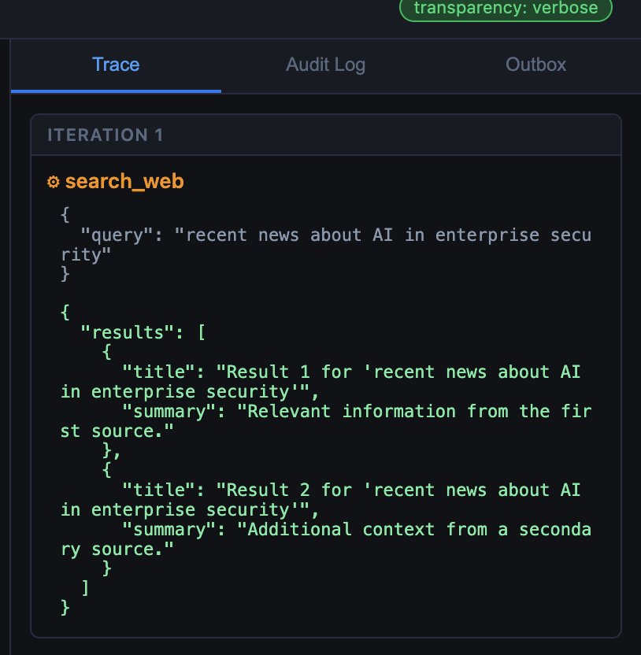

Lab 3 switches the agent from hardcoded tools to MCP-discovered tools — without
changing a line of agent code. You will see dynamic discovery in action, add
a new tool to a running system without restarting the agent, and observe that
the agent loop behaves identically regardless of which backend is active.

## Deploy


{}
```bash
cd lab-app/compose
docker compose --profile lab2 down 2>/dev/null; true
docker compose --profile lab3 up -d
```

Verify:
```bash
docker compose ps
curl -s http://localhost:8001/health | jq .
# Expected: "tool_mode": "mcp"
curl -s http://localhost:8001/tools | jq '.tools[].name'
# Expected: "query_employees", "send_message"
```
{}
{}
```bash
cd lab-app/helm
helm upgrade --install ai101 ./ai101 -f ai101/values-lab3.yaml
kubectl wait deployment/ai101-agent --for=condition=Available --timeout=120s
```
# only start if not already forwarded
```bash
kubectl port-forward svc/ai101-ui 8100:80 &
kubectl port-forward svc/ai101-agent 8001:8001 &
```

**Azure Cloud Shell users** — open the UI via Web Preview:
click the **Web Preview** icon (top-right toolbar) → **Configure** → port **8100** → **Open and browse**.
{}


---

## Step 1 — Same agent, different backend

Open the UI at [http://localhost:8080](http://localhost:8080) (Docker) or [http://localhost:8100](http://localhost:8100) / Web Preview URL (Kubernetes) and ask:

> Who is in the Engineering department?

The response is identical to Lab 2. The Trace panel shows the same tool call.
The only difference is how that call was dispatched: over HTTP to the MCP
server rather than as a direct function call in the same process.

Check how the agent currently sees its tools:


{}
```bash
curl -s http://localhost:8001/tools | jq '{mode: .mode, tools: [.tools[].name]}'
```
{}
{}
```
{
  "mode": "mcp",
  "tools": [
    "query_employees",
    "send_message"
  ]
}
```
{}


---

## Step 2 — Compare discovery vs hardcoded

Open `lab-app/images/agent/main.py` and compare the two loader functions:

```python
def _load_hardcoded() -> None:
    global _schemas, _dispatch
    _schemas  = tool_module.TOOL_SCHEMAS    # static list from tools.py
    _dispatch = tool_module.TOOL_FUNCTIONS

async def _discover_mcp() -> None:
    global _schemas
    async with streamablehttp_client(MCP_BASE_URL) as (read, write, _):
        async with ClientSession(read, write) as session:
            await session.initialize()
            result = await session.list_tools()
    _schemas = [                            # same format, different source
        {"type": "function", "function": {
            "name": t.name, "description": t.description, "parameters": t.inputSchema
        }}
        for t in result.tools
    ]
```

Both functions produce the same `_schemas` format. Everything below them in
`main.py` — the `_run_agent()` loop, the LLM call, the trace — is unchanged.

Now find `_run_tool()` and see how the dispatch differs between modes. The loop
itself never calls this function differently.

---

## Step 3 — Add a tool without restarting the agent


{}
```bash
cd lab-app/compose
ENABLE_EXTRA_TOOL=true docker compose --profile lab3 up -d mcp-server
```
{}
{}
```bash
helm upgrade ai101 ./ai101 -f ai101/values-lab3.yaml \
    --set mcpServer.enableExtraTool=true
```
{}
```
{}
Release "ai101" has been upgraded. Happy Helming!
NAME: ai101
LAST DEPLOYED: Wed Jul 15 19:13:24 2026
NAMESPACE: default
STATUS: deployed
REVISION: 8
DESCRIPTION: Upgrade complete
TEST SUITE: None
```
{}


- Only the MCP server was restarted. The agent container is still running with
its previous tool list. Trigger re-discovery without touching the agent:


{}
```bash
curl -s -X POST http://localhost:8001/tools/refresh | jq .
```
{}
{}
```
{
  "refreshed": true,
  "count": 3
}
```
{}


- Check updated tools now


{}

```bash
curl -s http://localhost:8001/tools | jq '.tools[].name'

```
{}
{}
```
{
  "refreshed": true,
  "count": 3
}
```
{}



The agent now knows about `search_web`. The model can call it on the next
request. No rebuild. No code change.

---

## Step 4 — Use the new tool

In the chat box:

> Search the web for recent news about AI in enterprise security.

The Trace panel should show `search_web` being called. The result is stubbed
(the server returns canned text), but the full discovery → schema registration
→ tool call → result flow is real.

 

---

## What just happened

The agent discovered and used a tool it had no knowledge of at startup, without
a code change or restart. This is exactly what makes MCP compelling for
production environments: tool capability expands without touching the agent.

It is also what makes it a new attack surface. The model reads tool
descriptions the same way it reads any other text — as instructions. A
description that has been modified by an attacker becomes an instruction the
model will follow. Module 4 shows what that looks like.

## Recap

You should now be able to:
- Explain the two-phase MCP interaction: discovery and execution.
- Describe what changes between Lab 2 and Lab 3 (only the tool backend).
- Add a tool to a running system and confirm the agent picks it up.


{}
```bash
curl -s http://localhost:8001/tools | jq '.tools | length'

```
{}
{}
```
3
```
{}


{}
When the agent routes through FortiAIGate, the gateway sees every MCP
tool-call request and response. AI Flow policies can inspect which tools are
being called and with what arguments — visibility the MCP server itself does
not provide. See the
[FortiAIGate Workshop](https://fortinetcloudcse.github.io/faig-training-workshop/).
{}
