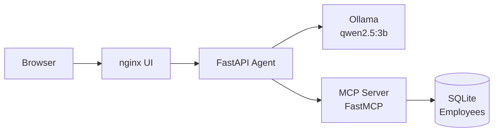

## What is this workshop?

This is a hands-on lab that takes you from raw LLM inference all the way through
a realistic agentic security attack, using a purpose-built application running
entirely on your laptop. The four lab exercises take roughly 2.5 hours; allow
~3 hours total including setup, a break, and wrap-up.

You will build a small HR assistant backed by a local LLM, connect it to tools,
extend it with MCP, and then break it deliberately — watching SQL injection,
data exfiltration, and audit-log contrast play out in real time.

## What you will build across the four labs

| Lab | Topic | Time |
|-----|-------|------|
| **Lab 1** — Inference | Direct LLM calls, prompt injection | ~30 min |
| **Lab 2** — Agents | Explicit tool-call loop, chained actions | ~45 min |
| **Lab 3** — MCP | Dynamic discovery, hot tool swap | ~30 min |
| **Lab 4** — Security | SQLi, data exfil, observability contrast | ~45 min |

## Learning objectives

After completing these labs you will be able to:

1. Explain how LLM inference works and why system-prompt isolation is not a
   security boundary.
2. Describe the agentic loop (LLM + loop + tools) and trace a multi-step tool
   call through the Trace panel.
3. Explain MCP and why dynamic tool discovery changes the attack surface.
4. Demonstrate SQL injection and data exfiltration through an AI agent, and
   explain why conventional controls miss it.
5. Articulate why audit logging is the prerequisite for any defensive response.

## Optional: FortiAIGate integration

This workshop stands on its own. All labs run against a local Ollama instance
with no external dependencies.

If you want to extend the experience with enterprise AI security controls, the
[FortiAIGate Workshop](https://fortinetcloudcse.github.io/faig-training-workshop/)
picks up where Lab 4 ends: you change one value (`OPENAI_BASE_URL`) to route the
same agent through FortiAIGate, then explore input/output guardrails, AI Flow
policies, and the detection story — using the same attack chain you ran in Lab 4.

## Prerequisites

See [Setup & Prerequisites](./01Intro) for the full list. Short version:

- Docker Engine + Compose v2 (or Kubernetes + Helm 3 for the K8s path)
- Git and a terminal
- ~8 GB RAM free; discrete GPU optional but speeds model loading significantly
